[](https://travis-ci.com/scau-tuzi/tiku)

# tiku

一个题库系统,旨在为其他应用提供一个公共题库，前后端练手项目。
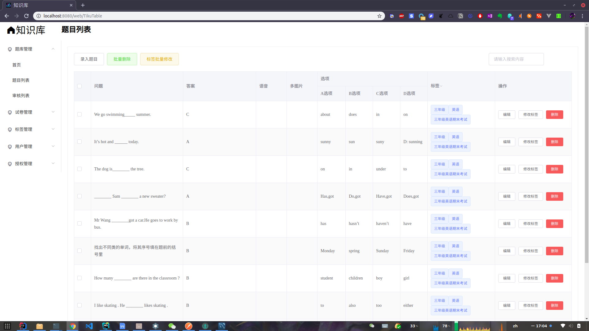

## 技术栈
* 后端
  * spring boot 系列
  * swagger 定义接口的
  * shiro 权限管理验证
* 前端
  * vue 
  * vuex vue的状态库
  * axios 网络库
  * el-element 组件库
## 架构

* 前后端分离的项目，后台分为管理平台和公共接口服务两部分。接口服务无前台，管理平台的前端使用VUE那一套组件方案，经由webpack构建后生成静态文件使用。
* 接口使用类REST+json形式（有些并未完全按照要求）。
* 公共接口使用swagger定义（原始文件在doc/api下）

## build

```bash
  cd ./source/front-end/tiku
  npm install -g yarn
  yarn global add @vue/cli
  yarn 
  yarn build
  cd ../../back-end/
  mvn package
```
## usage

* 使用script/sql下的脚本初始化数据库
* 从项目复制配置文件到jar包的运行目录，修改spring boot配置文件，运行jar包即可

## 开发
* 后端是一个标准的spring boot+maven项目，直接idea打开source/back-end目录，导入maven项目即可
* 管理平台前端是一个标准的，使用vue-cli的项目，开发方式与其他的vue项目一致，使用vscode或者webStorm打开

注意事项
* 前端开发可配置路由到题库后台进行开发
## 技术支持
直接提issues

## 协议
MIT
## 图
外部接口
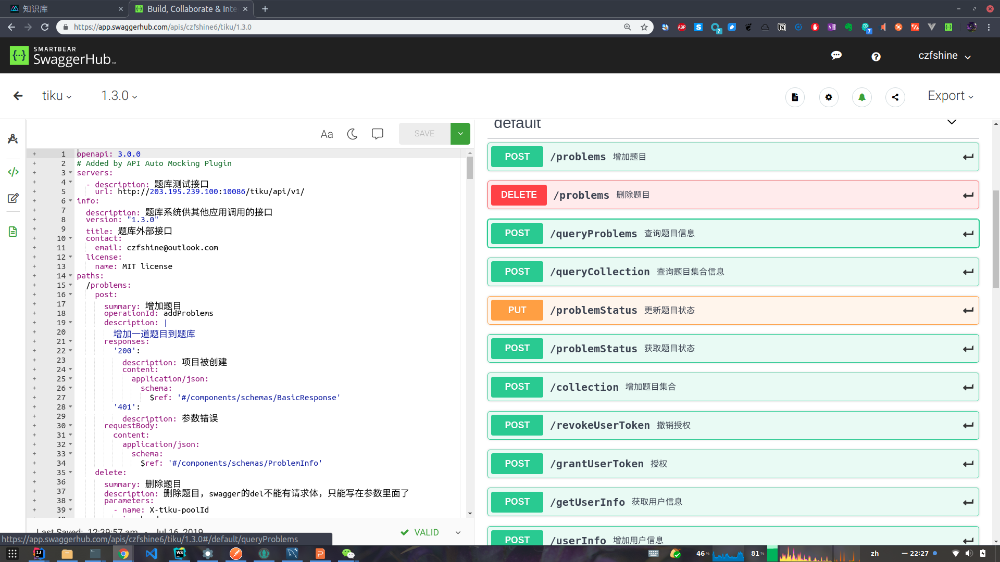


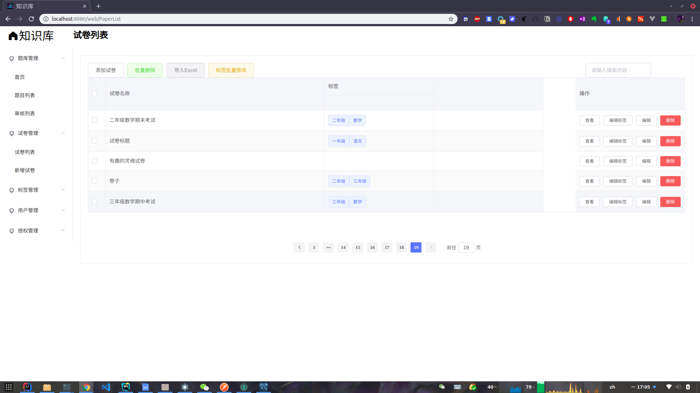
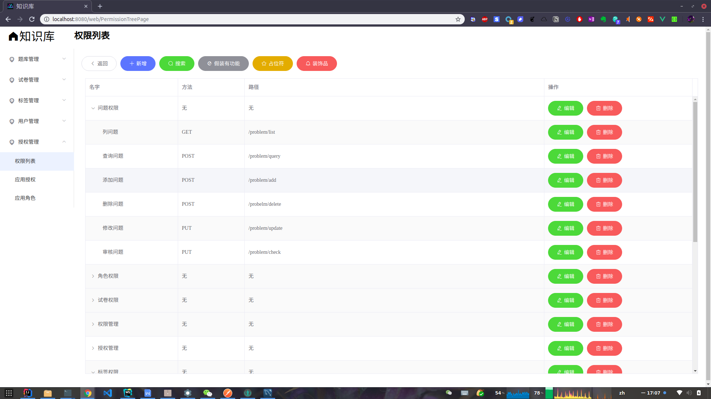
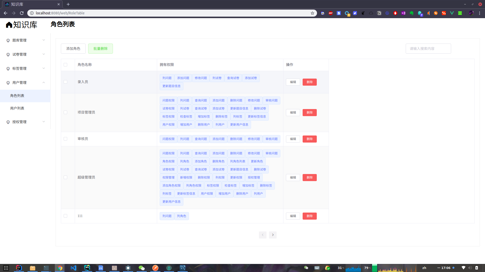

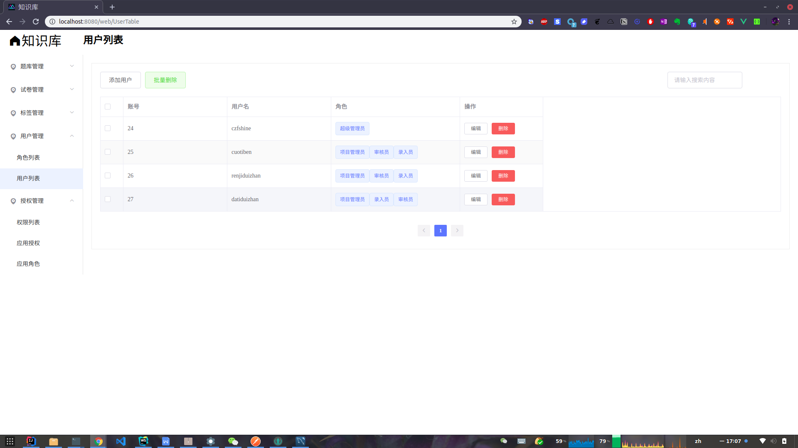
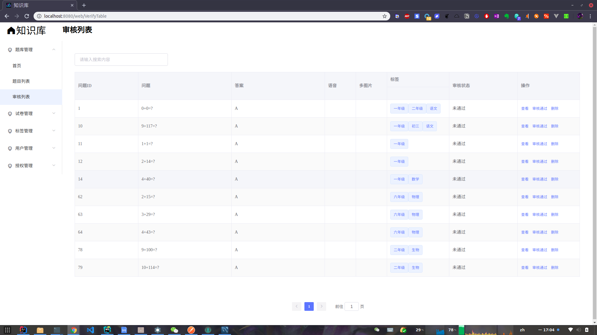
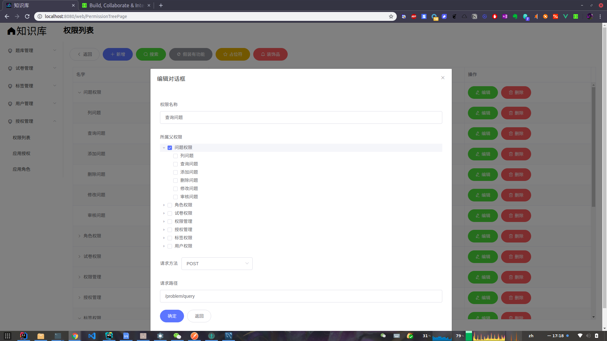
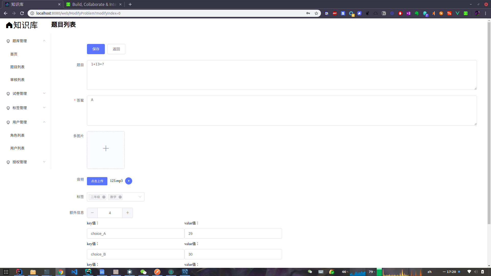
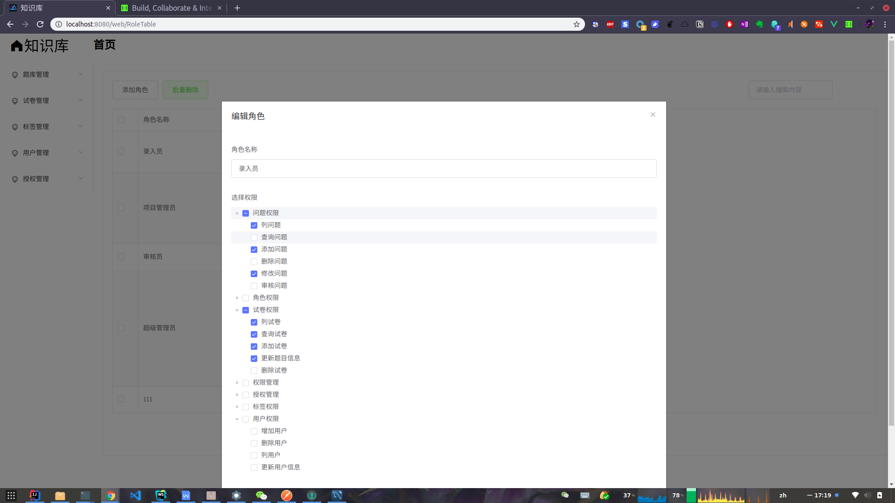
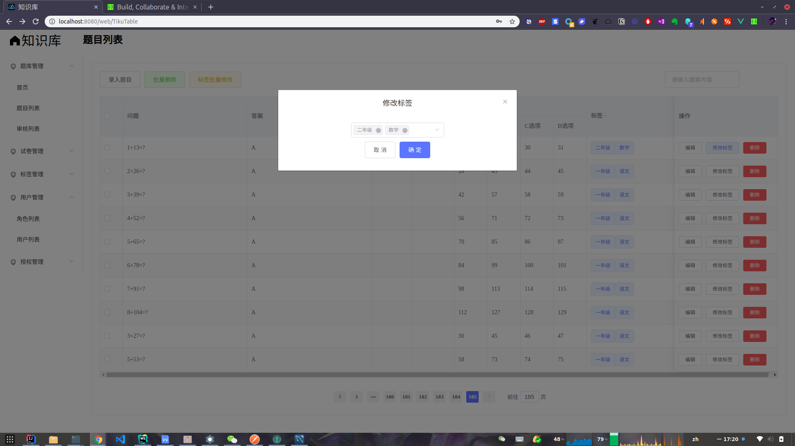
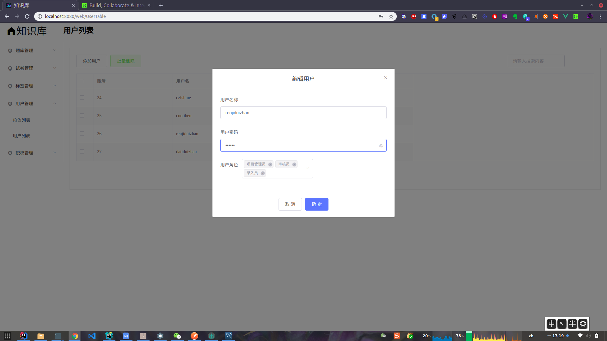
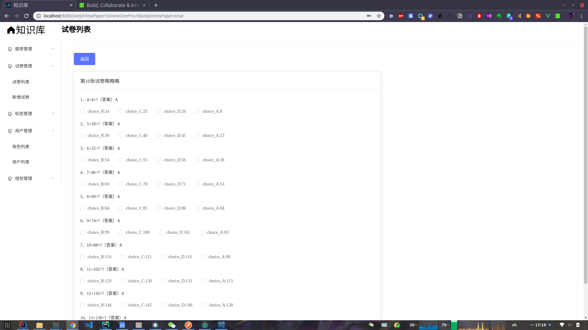
